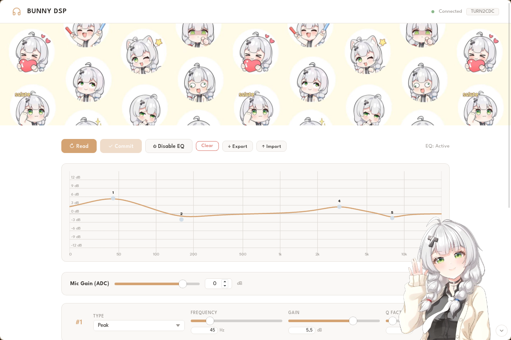
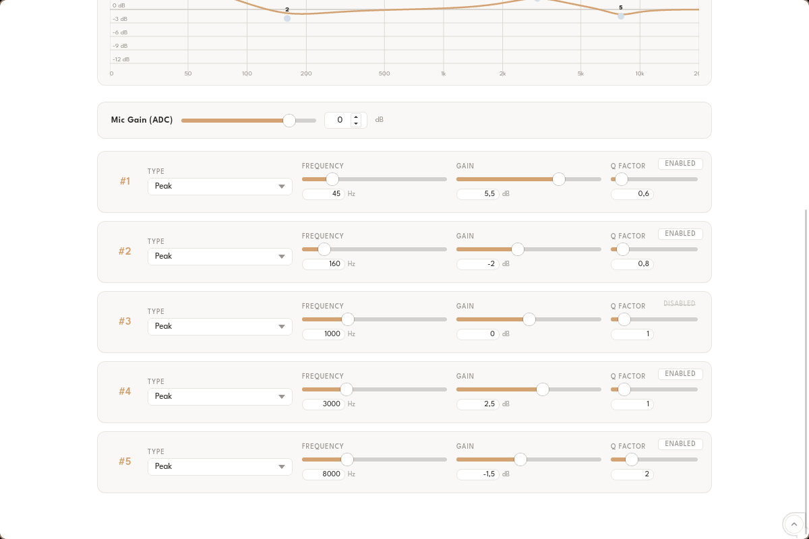

# Bunny DSP

A Bottle-based EQ controller app for the **Tanchjim Bunny DSP** USB-C IEMs written in python. It communicates with the onboard KTMicro DSP over raw USB HID, providing a cross-platform (mainly Linux) alternative to the official Windows- and Android-only applications.

<p align="center">
  
  
</p>

(Yes, some vibe-coding was involved, but I think I did a good job of keeping both the code and the visuals clean)

## Features

The Bunny DSP IEMs feature a KTMicro DAC/DSP chip with a hardware-baked, 5-band parametric EQ. This project programs the device by sending HID feature reports over USB, utilizing the chip's native support for standard USB HID class 1.1.

Each of the 5 bands supports:
* **Filter Types:** Peak (PK), Low Shelf (LSQ), and High Shelf (HSQ)
* **Gain:** +/-12 dB in 0.1 dB steps
* **Q Factor:** 0.1 to 10.0
* **Frequency:** 20 Hz to 20 kHz
* **Controls:** Per-band bypass/disable toggle, per-channel L/R digital volume, and ADC mic gain

The UI graph renders a composite frequency response from all active bands using biquad filter math, ensuring that what you see on screen matches exactly what the hardware produces. Each active band also shows a faint individual response curve behind the composite, so you can see how bands overlap. Filter dots are draggable -- grab one and move it horizontally to change frequency or vertically to adjust gain.

---

## Getting Started

All execution options require permission to access the USB HID device (see the [Permissions](#permissions) section below). If the device is not connected or permissions are missing, the UI will display an error. 

By default, the backend server will automatically bind to a random port between 18000 and 18999.

### Option 1: Download a pre-built binary (Recommended)
Download the latest release from the **Releases** tab and run it from your terminal:

```bash
./bunnydsp       # Opens in a native window
./bunnydsp --web # Opens in your default browser
```

### Option 2: Run from source

```bash
pip install -r requirements.txt
python app.py             # Opens in a native window
python app.py --web       # Opens in your default browser
```

### Option 3: Build from source

This method uses PyInstaller and `pywebview` to produce a standalone executable:

```bash
pip install -r requirements.txt -r requirements-build.txt
./build.sh
./dist/bunnydsp       # Native window
./dist/bunnydsp --web # Browser interface
```

### Permissions

The `hidraw` device requires elevated privileges to access. You can configure this using either of the following methods:

#### Method 1: udev rule (Recommended)

Create a file at `/etc/udev/rules.d/99-tanchjim-bunny.rules` with the following content:

```text
SUBSYSTEM=="hidraw", ATTRS{idVendor}=="31b2", ATTRS{idProduct}=="1112", GROUP="audio", MODE="0660", TAG+="uaccess"
```

Then, reload `udev` and add your user to the `audio` group:

```bash
sudo udevadm control --reload-rules
sudo udevadm trigger
sudo usermod -aG audio $USER
```

*Note: You must log out and back in (or reboot) for the group changes to take effect.*

#### Method 2: Using sudo

Run the script as root, preserving your environment variables so the server's dependencies resolve correctly:

```bash
sudo -E python3 app.py
```

*Without the `-E` flag, environment variables like `DISPLAY` are stripped, preventing the webview window from opening.*

---

## How the UI Works

The frontend features a single-page parametric EQ interface with a live, canvas-based frequency response graph. Updating the values in the control panel instantly recalculates the composite curve in real time using biquad filter formulas, letting you preview the response before writing it to the hardware.

| Control | Function |
| --- | --- |
| **Read** | Fetches and displays the current settings stored in the device's flash memory. |
| **Commit** | Writes the current UI state to the device's flash. The hardware will reset afterward (indicated by an audible beep). |
| **Disable/Enable EQ** | Toggles between flat bypass (slot 2) and custom EQ (slot 3). This also triggers a hardware reset. |
| **Clear** | Resets the UI sliders to flat. This does *not* affect the hardware until you click **Commit**. |
| **Export/Import** | Saves or loads the current UI profile as a local JSON file. |
| **Mic Gain** | Controls the ADC microphone gain register (0x65) from -60 dB to +12 dB. |
| **L Vol / R Vol** | Per-channel digital DAC volume (register 0x66), -60 to 0 dB. These replace the old single balance slider and match how the official app works. |

---

## Project Structure

```text
bunnydsp/
├── static/
│   ├── app.js             # EQ UI, biquad graph rendering, import/export
│   ├── style.css          # App styling
│   ├── favicon.png
│   ├── asano.png          # Togglable decoration in bottom-right corner
│   └── banner.png         # Header banner image
├── templates/
│   └── index.html         # Single-page app shell
├── screenshots/
│   ├── screenshot1.png    # UI screenshot (top)
│   └── screenshot2.png    # UI screenshot (bottom)
├── app.py                 # Bottle backend & HID protocol implementation
├── build.sh               # PyInstaller build script
├── LICENSE
├── requirements.txt       # Runtime dependencies
└── requirements-build.txt # Build dependencies
```

---

## The HID Protocol

The DSP chip exposes a vendor-defined feature report ID `0x4B` through HID interface 3. All EQ commands consist of 10-byte payloads preceded by this report ID byte.

### Command Structure

| Offset | Field |
| --- | --- |
| **0** | Register address (0x24-0x66) |
| **1-3** | Reserved (must be zero) |
| **4** | Command: `0x52` (read), `0x57` (write), `0x53` (commit), `0x43` (clear) |
| **5** | Reserved (must be zero) |
| **6-9** | Payload (little-endian) |

### Registers

| Address | Content |
| --- | --- |
| **0x24** | EQ slot selection: `2` = bypass, `3` = custom |
| **0x26-0x2F** | Five band pairs (gain + frequency, Q + filter type) |
| **0x54** | Device info (returns `TURN2CDC`) |
| **0x65** | Mic gain (digital ADC), -60 to +12 dB, int8 * 2 encoding |
| **0x66** | Per-channel digital DAC volume, -60 to 0 dB (byte 6 = L, byte 7 = R) |

### Band Encoding

Each EQ band spans two consecutive registers:

* **Even Register** (e.g., `0x26`): Gain (signed int16 LE, value / 10 = dB) + Frequency (uint16 LE, Hz)
* **Odd Register** (e.g., `0x27`): Q Factor (uint16 LE, value / 1000) + Filter Type (`0` = PK, `3` = LSQ, `4` = HSQ)

### Volume / Mic Gain Encoding (0x65, 0x66)

Volume and mic gain use **int8 * 2** encoding stored in a single unsigned byte:

```
encode: raw = dB * 2;  if raw < 0: raw += 256  -> unsigned byte
decode: signed = byte if byte <= 127 else byte - 256;  dB = signed / 2
```

| dB | Encoded byte |
|----|-------------|
| +12 | `0x18` (24) |
| 0   | `0x00` |
| -1  | `0xFE` (254) |
| -60 | `0x88` (136) |

### Commit & Reset Behavior

Sending the commit command (`0x53`) instructs the device to save all register contents to flash and perform a hardware reset. During this process, the `hidraw` node will briefly disappear and reappear under a different number within ~200ms.

The application automatically scans for new nodes and reconnects. Note that the device is entirely unresponsive during this window; any read/write attempts prior to a full reconnection will fail with an Input/Output error (`EIO`).

---

## Limitations / Future Work

* **Official App Presets:** The app does not currently have access to Tanchjim's official factory presets or their community forum's user-uploaded profiles.
* **Firmware Updates:** Flashing new DSP firmware still requires the official application, though hardware updates are generally rare.
* **Surround Sound:** The official Windows client allows switching between 5.1 and 7.1 virtual surround sound. It is currently unverified whether this is handled on the hardware level or emulated via Windows APIs.

---

## References

The HID protocol used in this project was reverse-engineered from:

* [jeromeof/devicePEQ](https://github.com/jeromeof/devicePEQ) (specifically `ktmicroUsbHidHandler.js` and the Bunny DSP configuration)
* Live USB packet captures performed on firmware v1.01 hardware
* USB descriptor dumps gathered from the device's HID interface 3
